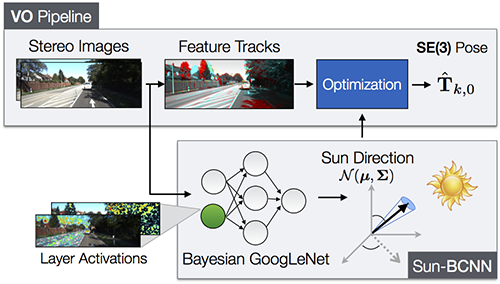

# Sun-BCNN
Bayesian Convolutional Neural Network to infer Sun Direction

## Installation & Pre-Requisites

1. Download and compile [Caffe-Sl](https://github.com/wanji/caffe-sl) (we use their L2Norm layer).

2. Ensure that the lmdb and cv2 python packages are installed.

3. Clone sun-bcnn:
```
git clone https://github.com/utiasSTARS/sun-bcnn-vo.git
```

## Testing with pre-trained model
1. Edit the following files:

## Testing with pre-trained model
2. Edit the following files:


##  Citation


##  References
[1] A. Geiger, P. Lenz, C. Stiller, and R. Urtasun, "Vision meets robotics: The KITTI dataset," Int. J. Robot. Research (IJRR), vol. 32, no. 11, pp. 1231–1237, Sep. 2013. [http://www.cvlibs.net/datasets/kitti/](http://www.cvlibs.net/datasets/kitti/)
